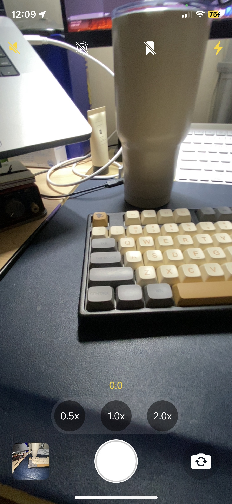
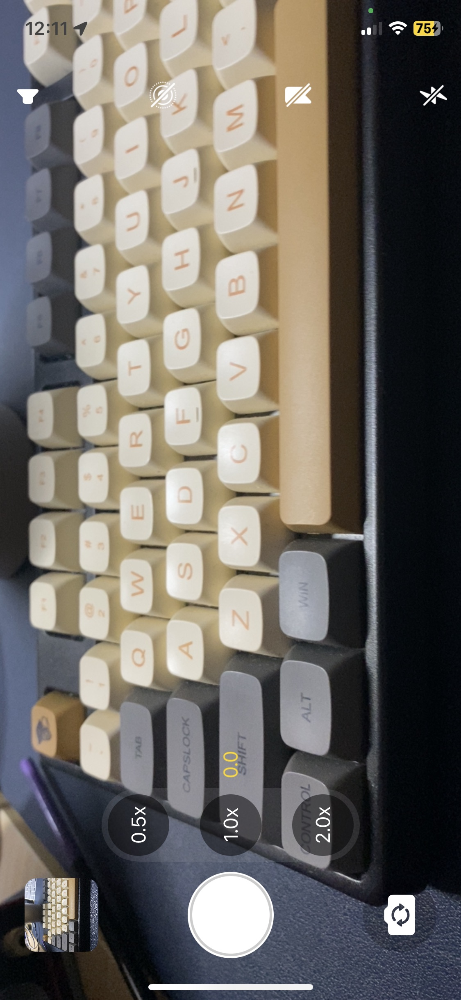
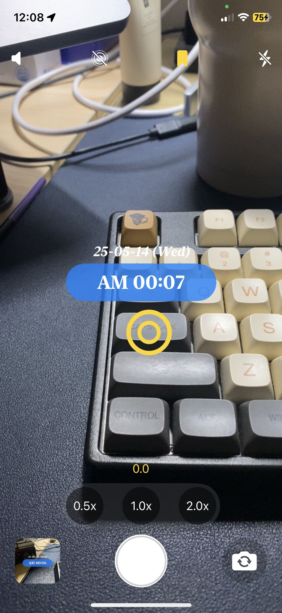
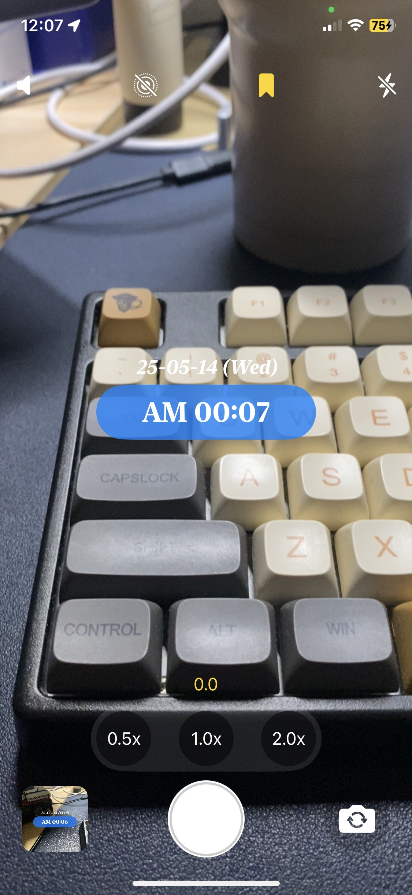
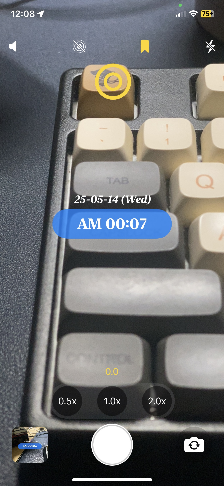
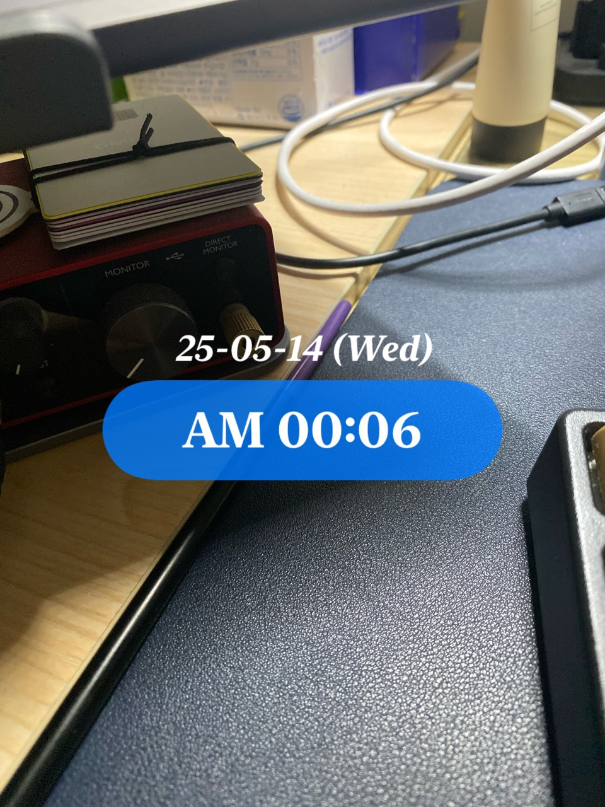
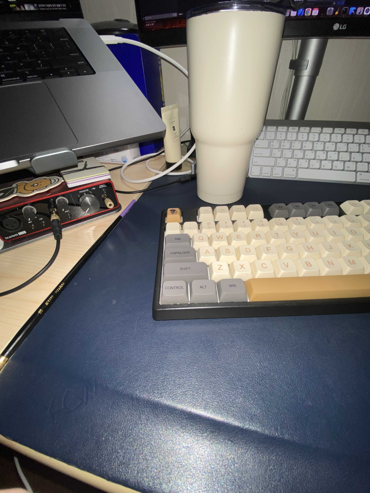

# CustomCamera

A customizable camera application.

## Features
- Take photos and browse the photo gallery
- Switch camera lenses (zoom levels and front camera)
- Zoom in functionality
- Enable or disable camera shutter sound
- Enable or disable Live Photo
- Add watermark and custom text
- Toggle flashlight during shooting

## Requirements
- iOS 17.0 or later

## Technologies Used 
- SwiftUI
- AVFoundation

## Screenshots

### 1. App UI  

---

### 2. Change Lens (Ultrawide, Wide, Telescope)  

---

### 3. Watermark & Flashback  

## REFERENCE

1. SwiftUI Camera Setup  
- https://betterprogramming.pub/effortless-swiftui-camera-d7a74abde37e  
- https://enebin.medium.com/swiftui%EB%A7%8C-%EC%8D%A8%EC%84%9C-%ED%98%B8%EB%8B%A5-%EC%B9%B4%EB%A9%94%EB%9D%BC%EC%95%B1-%EB%A7%8C%EB%93%A4%EA%B8%B0-feat-mvvm-1-2782b457f796

2. UIKit Camera Configuration (Flashlight, Live Photo, Switch Between Video/Photo)  
AVCam: Building a Camera App - Sample Code  
- https://developer.apple.com/documentation/avfoundation/capture_setup/avcam_building_a_camera_app

3. Locking Orientation and Rotating Icons  
- https://stackoverflow.com/questions/59140440/swiftui-disable-auto-rotation-of-views

4. Converting SwiftUI Views to Image  
- https://www.hackingwithswift.com/quick-start/swiftui/how-to-convert-a-swiftui-view-to-an-image  
- https://developer.apple.com/documentation/swiftui/imagerenderer

5. Importing from Photo Library  
Browsing and Modifying Photo Albums  
- https://developer.apple.com/documentation/photokit/browsing_and_modifying_photo_albums  
Browsing Your Photos  
- https://developer.apple.com/tutorials/sample-apps/capturingphotos-browsephotos